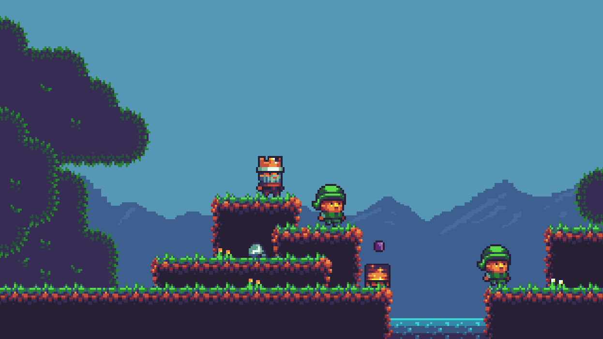

# King Craft 👑

A Godot Engine powered platformer. It's based on UmaiPixel's [tutorial series][1].

### [Play Now](https://kingcraft.vercel.app/) 🕹️

## Build Setup

1. Open the project in [Godot Engine 3](https://godotengine.org/download/archive/).
2. Export the project as HTML5, and choose **/dist** as the export directory.
3. Install the dependencies and preview your game at http://localhost:3000:
    ```bash
    npm install
    npm run preview
    ```
4. Create a Vercel production deployment:

    ```bash
    npm run deploy
    ```

## Screenshot



[1]: https://www.youtube.com/watch?v=MMsMtPVUtUE&list=PLyckz_-Rzq6ClGevL2fneJ5YJnMPKWa4M
